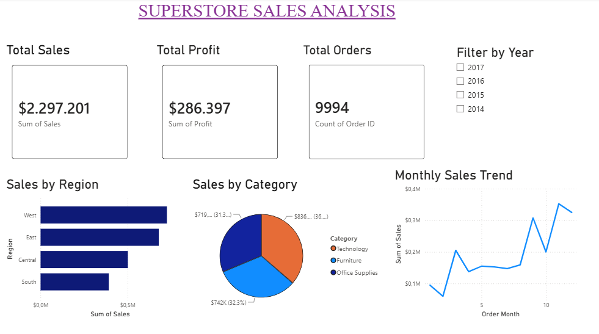
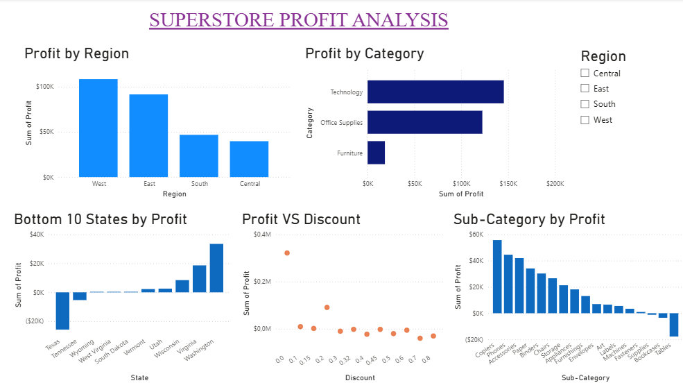
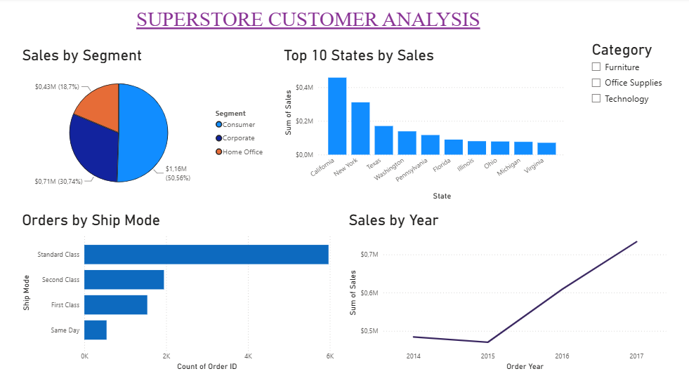

# Superstore Sales Analysis

## Project Overview
Analyzed 9,994 retail sales transactions from a US Superstore dataset to identify profit opportunities, sales trends, and business challenges using Python and Power BI.

## Problem Statement
- Which regions are most profitable?
- Which products are generating losses?
- Do discounts help or hurt profitability?
- Which states have the most valuable customers?

## Key Business Findings
1. The West region generated the highest sales ($725,457) and profit ($108,418).
2. The Tables sub-category incurred a loss of $17,725 despite high sales volume.
3. Texas shows strong sales but significant losses, indicating poor discount control or high fulfillment costs.
4. Higher discount tiers significantly reduce profitability, indicating that aggressive discounting is eroding margins.
5. California was the top-performing market with sales of $457,687.
6. The Consumer segment accounted for 52% of all orders.
7. The Bottom 10 States by profit reveal multiple consistently loss-making states, highlighting regional inefficiencies beyond Texas.


## Recommendations
- Reduce discounts in high-discount segments to improve profitability.
- Re-evaluate pricing strategy for loss-making sub-category (Tables).
- Investigate operational inefficiencies in Texas due to consistent losses.
- Focus marketing on Consumer segment (52% of orders) since it is the dominant customer base.
- Expand high-performing regions like West and California.

## What Makes This Project Unique
- Created five new analytical features not present in the Original Dataset.
- Proved discount impact using correlation analysis (r = -0.22).
- Identified loss-making states despite high sales volume.
- Built a three page interactive Power BI dashboard.
- Provided actionable business recommendations.

## Tools Used
- Python (Pandas, NumPy, Matplotlib, Seaborn)
- Power BI 
- Visual Studio Code (VS Code)

## Project Structure

```text
📁 Superstore Sales Analysis
├── 📁 Data
│   ├── 📄 Sample - Superstore.csv
│   └── 📄 Superstore_cleaned.csv
├── 📁 Notebook
│   └── 📄 main.py
├── 📁 Visuals
│   └── 📁 charts and dashboard screenshots
├── 📁 PowerBI
│   └── 📄 superstore_dashboard.pbix
└── 📄 README.md
```

## New Columns Created
|Columns | Description |
|--------|-------------|
|Profit Margin | (Profit/Sales) * 100 |
|Shipping Days | Ship Date - Order Date |
|Order Year | Year extracted from Order Date |
|Order Month Name | Month name extracted from Order Date |
|Discount Range | Low / Medium / High / Very High |


## How to Run
```bash
# Create virtual Environment
python -m venv sales_env

# Activate environment(Windows)
sales_env\Scripts\activate

# Install Libraries
pip install pandas numpy matplotlib seaborn

# Run analysis
python Notebook/main.py
```

## Dataset
- Source: Kaggle Superstore Dataset
- Total Rows: 9,994 real-world retail transactions (2014-2017)
- Original Columns: 21 
- Final Columns after feature engineering: 24
- Time Period: 2014-2017

## Dashboard Preview
### Sales Overview Dashboard


### Profit Analysis Dashboard


### Customer Analysis Dashboard



## Business Impact
This analysis helps identify revenue leakage, optimize discount strategies, and improve profitability across regions and product categories.
This project demonstrates an end-to-end data analytics workflow, from data cleaning and feature engineering to business insight generation and dashboard visualization.

## Author
**Suchithra Masuri**

## Connect with me
- LinkedIn: https://www.linkedin.com/in/suchithra-masuri-988902212/
- GitHub: https://github.com/suchithramasuri11-creator
